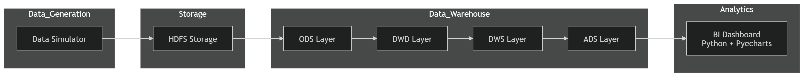
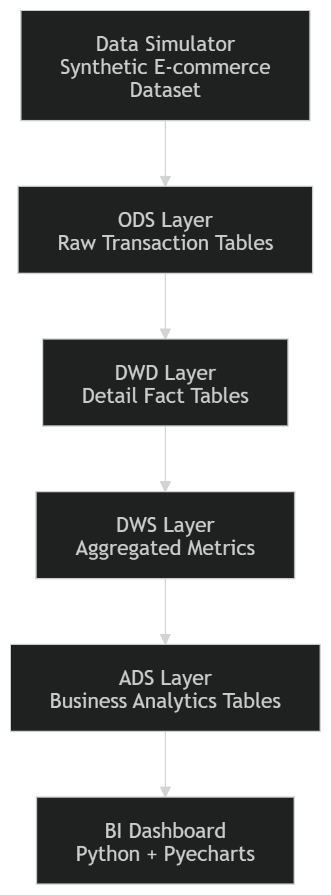
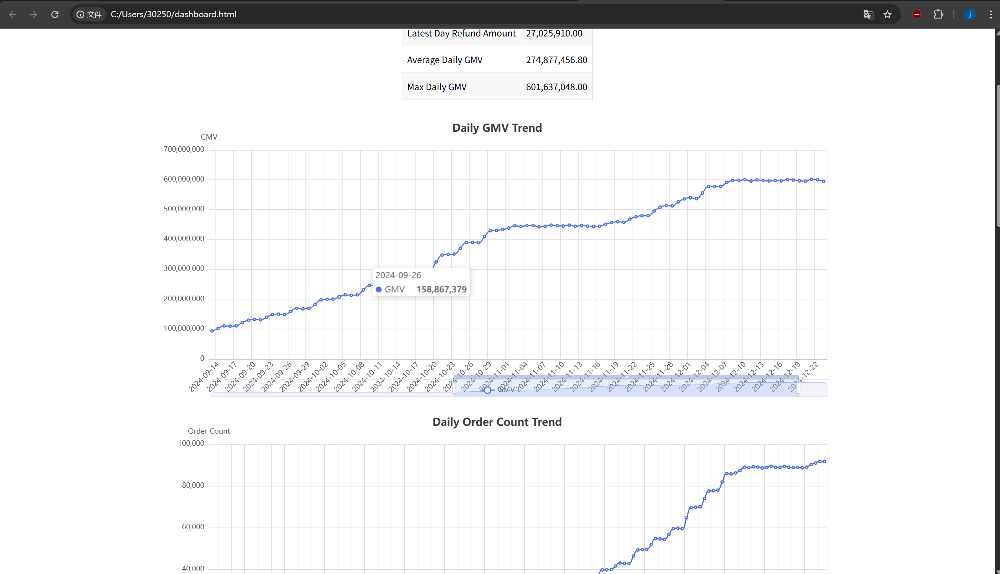

# E-commerce Offline Data Warehouse



An end-to-end **offline data engineering pipeline** simulating a real-world e-commerce analytics platform.

The project includes:

* large-scale **synthetic data generation**
* **layered data warehouse architecture**
* **Spark / Hive analytical processing**
* **BI dashboard visualization**

Dataset generator:

https://github.com/learner2638/ecommerce-data-simulator

Dataset scale:

**10M Orders | 25M Order Items | 35M+ Records**

---

# System Architecture



This project simulates a simplified **data engineering analytics platform**.

Pipeline overview:

```
Synthetic Data Generator
        ↓
ODS Layer (Raw Data)
        ↓
DWD Layer (Detail Fact Tables)
        ↓
DWS Layer (Aggregated Metrics)
        ↓
ADS Layer (Business Analytics)
        ↓
BI Dashboard
```

This architecture follows the **common offline data warehouse pattern used in industry systems**.

---

# Dataset

The dataset is generated using a custom **E-commerce Data Simulator**.

The simulator produces realistic e-commerce transaction data including:

* users
* shops
* SKUs
* orders
* order items
* refunds

---

# Dataset Scale

| Entity      | Count       |
| ----------- | ----------- |
| Orders      | 10,000,000  |
| Order Items | ~25,000,000 |
| Users       | 120,000     |
| Shops       | 8,000       |
| SKUs        | 35,000      |

Total records processed exceed **35 million rows**.

---

# Data Generation Configuration

Example configuration:

```
order_cnt = 10_000_000
user_cnt = 120_000
shop_cnt = 8_000
sku_cnt = 35_000

p_refund_given_paid = 0.18

batch_size = 300_000
workers = 6
```

The simulator supports **parallel data generation**, enabling efficient generation of tens of millions of records.

---

# Tech Stack

| Layer           | Technology            |
| --------------- | --------------------- |
| Data Generation | Python                |
| Storage         | Hadoop / HDFS         |
| Data Warehouse  | Hive                  |
| Query Engine    | Hive SQL / Spark      |
| Data Modeling   | ODS → DWD → DWS → ADS |
| Visualization   | Python + Pyecharts    |

---

# Data Warehouse Design

The warehouse follows a **four-layer modeling strategy**:

```
ODS → DWD → DWS → ADS
```

---

## ODS Layer

Raw transactional ingestion layer.

Example tables:

```
ods_orders
ods_order_items
ods_user_dim
ods_shop_dim
ods_sku_dim
```

---

## DWD Layer

Cleaned and standardized detail-level fact tables.

Example tables:

```
dwd_trade_order
dwd_trade_order_detail
dwd_trade_refund_detail
```

---

## DWS Layer

Aggregated service layer providing analytical metrics.

Example tables:

```
dws_trade_day_summary
dws_trade_category_day_summary
dws_trade_shop_day_summary
```

---

## ADS Layer

Application-facing analytical tables used by BI systems.

Example tables:

```
ads_trade_overview
ads_trade_top_category
ads_trade_top_shop
```

These tables power the BI dashboard.

---

# Partition Strategy

Warehouse tables are partitioned by date.

```
PARTITIONED BY (dt)
```

Example structure:

```
ads_trade_overview
 └── dt=2024-07-01
 └── dt=2024-07-02
 └── dt=2024-07-03
```

Benefits:

* efficient incremental loading
* reduced scan cost
* faster analytical queries

---

# BI Dashboard

The BI layer is implemented using **Python + Pyecharts**.

Key metrics visualized:

* Daily GMV Trend
* Daily Order Count
* Daily User Count
* Refund Amount Trend
* Top Categories by GMV
* Top Shops by GMV

---

# Dashboard Preview



---

# Analytical Metrics

### Core Metrics

```
GMV (Gross Merchandise Volume)
Order Count
User Count
Refund Amount
Average Order Value
Refund Rate
```

### Ranking Metrics

```
Top Categories by GMV
Top Shops by GMV
```

---

# BI Visualization Pipeline

```
ADS Tables
     ↓
CSV Export
     ↓
Python Data Processing (Pandas)
     ↓
Pyecharts Visualization
     ↓
Interactive HTML Dashboard
```

Final dashboard output:

```
dashboard.html
```

---

# Repository Structure

```
ecommerce-data-warehouse
│
├── build_dashboard.py
├── dashboard.html
├── README.md
│
└── docs
    ├── system_architecture.png
    └── dashboard_preview_1.png
```

---

# How to Run

### 1 Generate Dataset

Use the simulator repository:

https://github.com/learner2638/ecommerce-data-simulator

---

### 2 Load Data into HDFS

Upload generated CSV files into HDFS and register Hive tables.

---

### 3 Run Data Warehouse Pipeline

Execute SQL pipeline:

```
ODS → DWD → DWS → ADS
```

Processing engines:

```
Hive SQL
Spark SQL
```

---

### 4 Export BI Data

Export ADS tables to CSV.

---

### 5 Build Dashboard

Run:

```
python build_dashboard.py
```

This generates an **interactive HTML dashboard**.

---

# Engineering Details

### Parallel Data Generation

```
workers = 6
batch_size = 300000
```

This enables efficient generation of **tens of millions of records**.

---

### Data Volume

| Dataset       | Size |
| ------------- | ---- |
| Orders        | 10M  |
| Order Items   | 25M  |
| Total Records | ~35M |

---

### Storage Size

The generated dataset occupies **multiple gigabytes**, depending on storage format.

---

# Practical Skills Demonstrated

This project demonstrates core **data engineering skills**:

* large-scale synthetic data generation
* offline data warehouse architecture
* Hive-based analytical processing
* layered warehouse modeling
* BI visualization development
* end-to-end analytics pipeline design

---

# Future Improvements

Possible enhancements:

### Real-Time Data Pipeline

```
Kafka
Flink
Spark Streaming
```

### Query Engine

```
Presto
Trino
ClickHouse
```

### Workflow Orchestration

```
Apache Airflow
```

### Advanced BI Platforms

```
Apache Superset
Metabase
Tableau
```

### Containerized Deployment

```
Docker
Docker Compose
```

---

# Data Source

The dataset used in this project is generated using the custom **E-commerce Data Simulator** developed by the author.

---

# Author

Developed as part of a **data engineering learning and experimentation process**, focusing on building a simplified end-to-end analytics pipeline.
